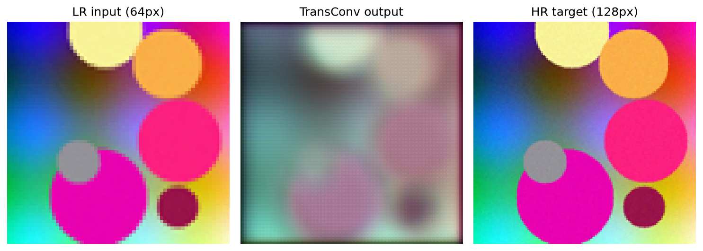

# Results

The full project trains on COCO with a GPU (not redistributed). To provide a
**reproducible smoke run with no external data**, `run_all.py` synthesizes a
tiny image set and trains `TransConv` for 10 epochs on CPU at reduced resolution
(LR 64px → HR 128px, seed 0):

```bash
python run_all.py
```

Artifacts under [`results/`](results/).

## Smoke-run training (synthetic data)

MSE loss decreases steadily over 10 epochs
([`results/train.log`](results/train.log),
[`results/metrics.json`](results/metrics.json)):

| epoch | 1 | 4 | 7 | 10 |
| --- | --- | --- | --- | --- |
| MSE loss | 0.229 | 0.077 | 0.063 | ~0.046 |

`TransConv` has **208,707** parameters (full layer/shape breakdown in
[`results/model_summary.txt`](results/model_summary.txt)).

## Qualitative sample

A held-out synthetic image, its `TransConv` 2× reconstruction, and the HR
target:



*This is a pipeline sanity check on synthetic data, not a super-resolution
benchmark. For real PSNR numbers, train on COCO and evaluate with `test.py` (see
the presentation in `docs/`).*

## Original notebook figure

The qualitative comparison produced by the original `performance` notebook —
the 512² original beside the cascaded `UUDCNN` → `IMCNN` reconstruction, run on
a COCO test image — is preserved at
[`results/notebook_reference/performance__cell07_1.png`](results/notebook_reference/performance__cell07_1.png).
Unlike the synthetic sanity check above, this one comes from the real training
data used in the project.
